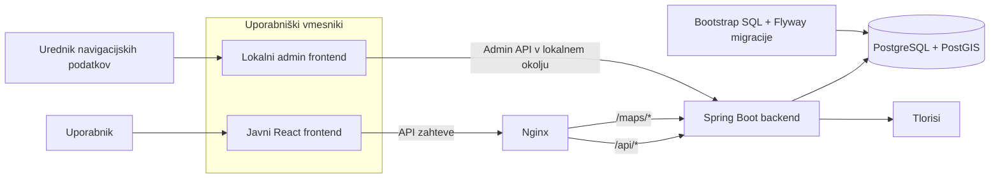
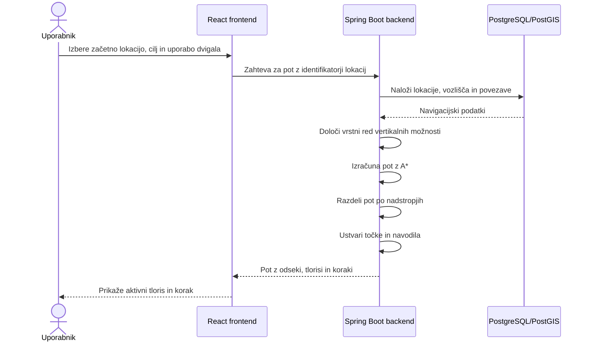

# Arhitektura sistema

Ta dokument podaja kratek mentalni model FERI Navigatorja: kateri deli sestavljajo sistem, za kaj so odgovorni in kako med seboj sodelujejo.

Podrobnosti posameznih področij so opisane v ločenih dokumentih za frontend, backend in podatke.

## Pregled sistema

V lokalnem Docker okolju so frontend, backend in podatkovna baza dostopni tudi na ločenih vratih. V produkcijskem Compose okolju je javno izpostavljen samo Nginx, ki zahteve za API in tlorise posreduje backendu.

## Glavne komponente

### Javni frontend

Javni frontend je React aplikacija za:

- iskanje objektov in prostorov;
- prikaz podrobnosti prostora;
- izbor začetne in ciljne lokacije;
- prikaz tlorisa, poti in navodil;
- deljenje izbrane poti;
- preklop med slovenščino in angleščino.

Frontend ne računa poti in ne odloča, kateri prehodi so dovoljeni. Backend mu vrne že izračunano pot, razdeljeno na odseke po nadstropjih.

### Lokalni admin frontend

Admin frontend je lokalno orodje za urejanje navigacijskega grafa:

- vozlišč;
- povezav;
- prehodov med nadstropji;
- navodil in orientacijskih točk.

Spremembe se najprej shranjujejo v povezano lokalno podatkovno bazo. Admin lahko nato izvozi SQL posnetek podatkov, ki ga je treba pregledati in vključiti v nadzorovan migracijski postopek.

Admin frontend ni del javnega produkcijskega vmesnika.

### Backend

Spring Boot backend je osrednji aplikacijski sloj. Odgovoren je za:

- katalog objektov in prostorov;
- iskanje lokacij;
- nalaganje navigacijskega grafa;
- izračun poti z algoritmom A*;
- izbiro načina prehoda med nadstropji;
- iskanje najbližjega podprtega cilja, trenutno WC-ja;
- delitev poti na odseke po objektih in nadstropjih;
- pripravo besedilnih navodil;
- shranjevanje in razreševanje deljenih poti;
- serviranje tlorisov;
- lokalne admin operacije in SQL izvoz.

Backend je vir resnice za navigacijsko vedenje. Frontend uporablja njegove pogodbe in rezultate samo prikaže.

### PostgreSQL in PostGIS

Podatkovna baza hrani:

- objekte, nadstropja in prostore;
- lokacije, ki jih lahko izbere uporabnik;
- navigacijska vozlišča in povezave;
- tipe vozlišč, povezav in prostorov;
- metapodatke tlorisov in koordinatne sisteme;
- deljene poti.

PostGIS se uporablja za geometrijo navigacijskega grafa. Koordinate niso geografske GPS-koordinate, temveč lokalne koordinate posameznega tlorisa.

### Tlorisi

Tlorisi so slikovne datoteke, povezane z nadstropji v podatkovni bazi. Backend jih servira prek poti `/maps/`, frontend pa čez sliko nariše pot v istem koordinatnem sistemu.

Slika, dimenzije koordinatnega sistema in točke poti morajo ostati medsebojno usklajene.

## Tok izračuna poti

Frontend backendu pošlje stabilne identifikatorje izbranih lokacij, ne prostega besedila. To preprečuje dvoumnost pri lokacijah z enakim ali podobnim imenom.

Če uporabnik izbere **Najbližji WC**, backend pregleda podprte cilje, izračuna dosegljive poti in vrne najugodnejšo.

## Drugi pomembni tokovi

### Pregled objektov in prostorov

Frontend od backenda pridobi seznam objektov in njihove prostore. Podatke predstavi kot iskalne rezultate in podrobnosti, ne da bi sam vzdrževal ločeno kopijo kataloga.

### Deljenje poti

Pri deljenju backend shrani:

- začetno lokacijo;
- izbrani cilj ali vrsto cilja;
- nastavitev uporabe dvigala;
- kratko kodo za deljeno povezavo.

Ne shranjuje nespremenljive kopije izračunane geometrije. Ko prejemnik odpre povezavo, se pot ponovno izračuna s trenutnimi navigacijskimi podatki.

### Urejanje navigacijskega grafa

Admin UI ni produkcijski vir resnice. Trajne spremembe podatkov morajo biti pregledane, zapisane v repozitoriju in uvedene skozi migracijski postopek.

## Meje odgovornosti

### Frontend

Frontend je odgovoren za uporabniško izkušnjo, stanje zaslona, izbiro lokacij in prikaz rezultata. Ne sme sam uvajati pravil rutiranja ali popravljati neveljavnih podatkov iz backenda z lokalnimi približki.

### Backend

Backend je odgovoren za validacijo zahtev, poslovna pravila, izračun poti, sestavo odgovorov in nadzor dostopa do admin funkcij glede na aktivni način.

Sprememba oblike backend odgovora je sprememba pogodbe in zahteva uskladitev frontend tipov, odjemalcev, testov in dokumentacije.

### Podatkovna baza

Podatkovna baza je vir resnice za katalog, tlorise in navigacijski graf. Identifikatorji vozlišč, povezave med lokacijami in vozlišči ter dimenzije zemljevidov so del funkcionalne pogodbe sistema.

### Git in migracije

Git hrani pregledano zgodovino kode in podatkovnih sprememb. `database/init/` pripravi novo prazno bazo, Flyway migracije pa uvajajo spremembe po začetnem zagonu.

## Ključne arhitekturne odločitve

- Navigacijski graf in katalog se hranita v podatkovni bazi.
- Pot se računa na backendu, ne v brskalniku.
- Frontend izbira lokacije po stabilnih identifikatorjih.
- Rezultat poti je razdeljen na odseke po objektih in nadstropjih.
- Tlorisi in poti uporabljajo skupni lokalni koordinatni sistem.
- Javni frontend in backend podpirata slovenščino in angleščino.
- Admin je lokalno razvojno orodje; produkcijske podatkovne spremembe potujejo skozi Git in migracije.

## Trenutne omejitve

- Varnostna konfiguracija trenutno dovoljuje javne zahteve API-ja brez prijave.
- Admin endpointi so v produkcijskem profilu izklopljeni, vendar vključen admin način sam po sebi ne zagotavlja avtentikacije ali avtorizacije.
- Produkcijski Compose ne zagotavlja TLS terminacije, upravljanja skrivnosti, monitoringa ali varnostnih kopij.
- Kakovost navigacije je neposredno odvisna od popolnosti vozlišč, povezav, lokacij in metapodatkov tlorisov.
- Del sistema še uporablja kombinacijo začetnega SQL bootstrap postopka in Flyway migracij, zato njunih vlog ni dovoljeno zamenjevati.

## Povezana dokumentacija

- [`repository-structure.md`](repository-structure.md) za tehnologije, mape in vire resnice;
- [`frontend.md`](frontend.md) za podrobnejši frontend mentalni model;
- [`backend-and-api.md`](backend-and-api.md) za backend in API pogodbe;
- [`data-and-navigation.md`](data-and-navigation.md) za podatkovni model, graf in migracije;
- [`deployment-and-operations.md`](deployment-and-operations.md) za produkcijsko okolje.
