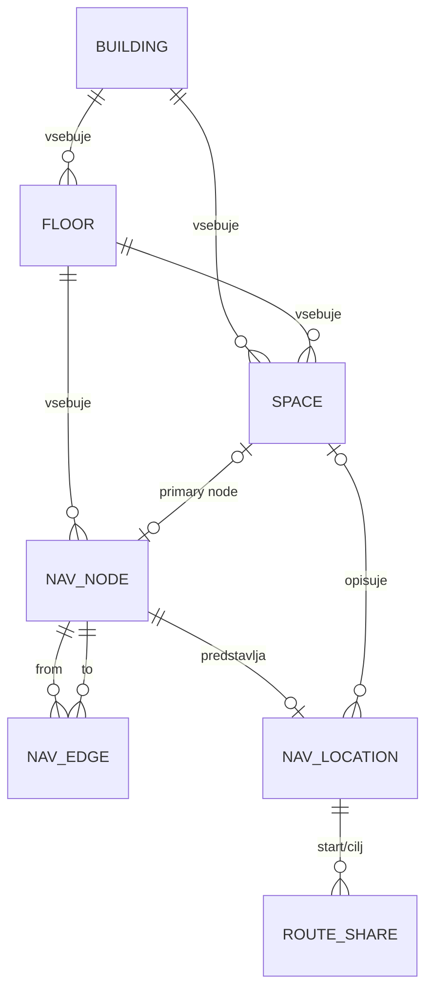

# Podatki in navigacija

Ta dokument opisuje podatkovni model, tlorise, navigacijski graf, izračun poti in varen postopek spreminjanja podatkov.

## Mentalni model

Uporabniški prostor in navigacijsko vozlišče nista ista stvar:

- **objekt** predstavlja stavbo;
- **nadstropje** pripada objektu in določa tloris;
- **prostor** je resnična učilnica, laboratorij, pisarna ali druga lokacija;
- **navigacijska lokacija** je izbira, ki jo vidi uporabnik;
- **vozlišče** je tehnična točka v grafu;
- **povezava** določa dovoljeno premikanje med dvema vozliščema.



## Glavne tabele

### `buildings`

Stavbe oziroma objekti FERI. `code` je stabilna kratka oznaka in je unikaten.

### `floors`

Nadstropje znotraj objekta. Hrani:

- oznako in prikazno ime;
- nivo in `z`;
- `map_image_url`;
- `coordinate_width`;
- `coordinate_height`.

Koordinatne dimenzije morajo biti pozitivne in morajo ustrezati sistemu, v katerem so bila postavljena vozlišča.

### `spaces`

Uporabniku razumljivi prostori. Prostor pripada objektu, nadstropju in tipu prostora. `primary_node_id` ga lahko poveže z glavnim navigacijskim vozliščem.

### `navigation_nodes`

Točke navigacijskega grafa. Pomembna polja:

- `external_id`, globalno unikaten in stabilen;
- `floor_id`;
- tip vozlišča;
- `x`, `y`, `z`;
- PostGIS `geom`;
- `is_waypoint` in `is_public`;
- opcijska povezava s prostorom.

`external_id` se uporablja pri SQL izvozu in migracijah. Spreminjanje obstoječih vrednosti lahko prekine povezave ali povzroči podvajanje.

### `navigation_edges`

Usmerjene povezave med vozlišči. Hrani:

- izvorno in ciljno vozlišče;
- tip povezave;
- pozitivno težo;
- geometrijo;
- oznake za dvosmernost ter prehod med nadstropji ali objekti;
- opcijska navodila in orientacijsko točko.

A* bere povezave v smeri `from_node_id -> to_node_id`. Če je premikanje dovoljeno v obe smeri, morata v podatkih obstajati oba usmerjena zapisa. Oznaka `is_bidirectional` sama po sebi ne nadomesti obratnega zapisa pri iskanju poti.

### `navigation_locations`

Seznam lokacij, ki jih frontend ponudi uporabniku. Vsaka lokacija je vezana na eno vozlišče in vsebuje prikazno ter iskalno ime, tip, objekt, nadstropje in opcijski prostor.

Javni route endpoint uporablja ID navigacijske lokacije. Ne uporablja prostega imena prostora.

### `navigation_route_shares`

Shrani kratko kodo in vhodne podatke deljene poti. Geometrija se ne shrani; pot se ob odprtju ponovno izračuna.

## Koordinate in tlorisi

Koordinate so lokalne koordinate tlorisa, ne GPS in ne CSS piksli.

Pogodbo enega nadstropja sestavljajo:

```text
map_image_url
coordinate_width
coordinate_height
vozlišča z x/y koordinatami
```

Frontend uporabi koordinatne dimenzije kot SVG `viewBox`, zato se pot pravilno prilagaja različnim velikostim zaslona.

Ob zamenjavi tlorisa je treba preveriti, ali nova slika uporablja isti koordinatni sistem. Če ga ne, je treba uskladiti vse koordinate vozlišč in povezav.

Glavni backend vir slik je `database/maps/`. Produkcijski backend slike kopira v container ob buildu. Lokalni Compose mapo priklopi kot read-only volume, kar omogoča hitrejše lokalno delo.

## Izračun poti

Backend:

1. naloži začetno in ciljno navigacijsko lokacijo;
2. preveri, ali imata vozlišče;
3. določi vrstni red vertikalnih načinov;
4. za vsak poskus pokliče A*;
5. izbere prvo veljavno pot;
6. razdeli jo ob spremembi objekta ali nadstropja;
7. pripravi točke in besedilne korake.

Teža poti je vsota `weight` vrednosti povezav. Manjša skupna teža predstavlja ugodnejšo pot.

### Dvigalo in stopnice

`allowElevator` določa preferenco:

- na istem nadstropju se uporabi splošno iskanje;
- pri različnih nadstropjih backend najprej poskusi preferirani način;
- če ta ne uspe, lahko poskusi nadomestni način.

Zato izklop možnosti **Uporabi lift** trenutno ne pomeni stroge prepovedi dvigala v vseh primerih.

### Najbližji WC

Backend poišče omogočene lokacije tipa `wc`, izračuna dosegljive poti in izbere kandidatko z najmanjšim `totalCost`.

## Segmenti in navodila

Pot je razdeljena na segment, ko se spremeni:

- nadstropje;
- objekt.

Vsak segment ima svoj tloris, koordinatne dimenzije, pot in korake.

Navodila nastajajo iz:

- ročno vnesenega `instruction_forward`, kadar obstaja;
- tipa povezave;
- tipa in oznake vozlišča;
- smeri zavoja;
- prehoda z dvigalom, stopnicami ali med objekti;
- ciljne lokacije.

Tehnična waypoint vozlišča se lahko združijo v daljši razumljiv korak. Pri spremembi generatorja je treba preveriti tudi geometrijo aktivnega koraka v frontendu.

## Bootstrap in Flyway

### Nova prazna baza

Docker ob prvem ustvarjanju volume-a izvede SQL datoteke v `database/init/` po imenu:

```text
001_schema.sql
002_seed_data.sql
...
009_g2_search_aliases.sql
```

Te datoteke predstavljajo bootstrap nove baze.

Če volume že vsebuje podatke, sprememba `database/init/` ne bo samodejno ponovno izvedena.

### Obstoječa baza

Spremembe po bootstrapu sodijo v:

```text
backend/src/main/resources/db/migration/
```

Flyway migracija mora:

- imeti novo, še neuporabljeno verzijo;
- biti ponovljiva na pričakovanem stanju baze;
- uporabljati stabilne poslovne identifikatorje, kjer je mogoče;
- biti pregledana pred deployem.

Že uporabljene Flyway migracije se ne spreminjajo.

Datoteki `V2026_06_01_001__baseline_placeholder.sql` in `V2026_06_01_002__admin_graph_snapshot_template.sql` sta rezervirana placeholderja in se ne uporabljata za nove dejanske spremembe.

## Admin workflow

Priporočen postopek spremembe grafa:

1. lokalno zaženite bazo, backend in admin frontend;
2. uredite vozlišča ali povezave;
3. preverite znane poti v route preview-u;
4. ustvarite SQL izvoz;
5. preglejte izvoz in diff;
6. vsebino pretvorite v novo Flyway migracijo;
7. zaženite backend teste in preverite relevantne poti;
8. commitajte migracijo skupaj z razlogom spremembe.

Admin export lahko zajame lookupe, objekte, nadstropja, prostore, vozlišča, povezave in lokacije ter odstrani zastarele vrstice znotraj izvoženih objektov. Zato ga ni dovoljeno slepo izvesti na produkcijski bazi.

## Varne spremembe

### Dodajanje nadstropja ali tlorisa

Preverite:

1. objekt in unikaten `floor.code`;
2. `level_number` in `z`;
3. sliko v `database/maps/`;
4. `map_image_url`;
5. koordinatno širino in višino;
6. vozlišča na novem nadstropju;
7. vsaj eno povezavo z obstoječim grafom, če naj bo dosegljivo.

### Dodajanje prostora ali lokacije

Prostor mora imeti pravilen objekt, nadstropje in tip. Za navigacijo mora obstajati povezano vozlišče in omogočena `navigation_locations` vrstica.

### Spreminjanje vozlišča

Ne spreminjajte `external_id` brez pregleda vseh povezav, lokacij, prostorov in migracij. Premik koordinat zahteva pregled vseh povezanih robov in vizualno preverjanje tlorisa.

### Spreminjanje povezave

Preverite smer, tip, težo, cross-floor/cross-building oznake in obratno smer. Po spremembi preverite poti v obe smeri.

## Kritične invariante

- Vsaka navigacijska lokacija kaže na obstoječe vozlišče.
- `external_id` vozlišča je stabilen in unikaten.
- Povezava ne sme kazati iz vozlišča nazaj v isto vozlišče.
- Teža povezave mora biti večja od nič.
- Dvosmerno gibanje zahteva oba usmerjena zapisa.
- Tloris in koordinate uporabljajo isti sistem.
- Pot med nadstropji potrebuje dejanske cross-floor povezave.
- Produkcijska podatkovna sprememba mora biti pregledana migracija.
- Ročna sprememba žive baze ni nadomestilo za migracijo.

## Tipične napake

| Simptom | Verjeten vzrok |
|---|---|
| Lokacija je v iskanju, pot pa ne deluje | Lokacija nima pravilno povezanega vozlišča |
| Pot deluje samo v eno smer | Manjka obratna usmerjena povezava |
| Črta ne sledi tlorisu | Napačne koordinate ali dimenzije |
| Pot ne preklopi nadstropja | Manjka cross-floor povezava ali metapodatki |
| Najbližji WC ni na voljo | Ni omogočenih WC lokacij z vozliščem ali dosegljivo potjo |
| Sprememba init SQL ni vidna | Baza uporablja že inicializiran Docker volume |
| Flyway checksum napaka | Spremenjena je bila že uporabljena migracija |

## Povezana dokumentacija

- [`architecture.md`](architecture.md) za sistemske meje;
- [`backend-and-api.md`](backend-and-api.md) za route pogodbo;
- [`frontend.md`](frontend.md) za prikaz tlorisa in korakov;
- [`development.md`](development.md) za lokalni admin workflow;
- [`deployment-and-operations.md`](deployment-and-operations.md) za backup in uvajanje migracij.
